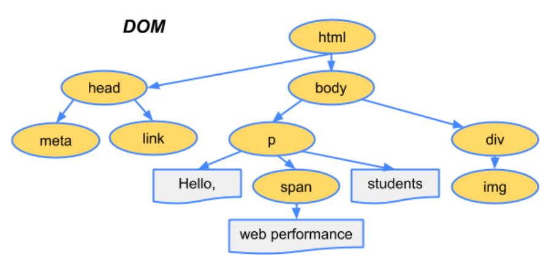
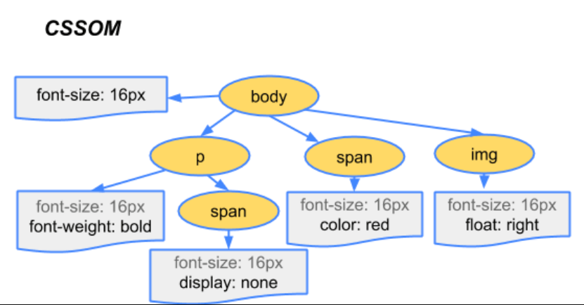
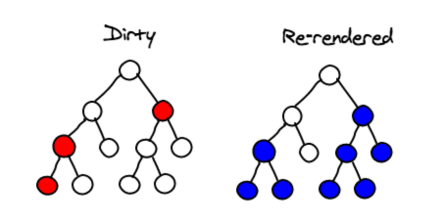
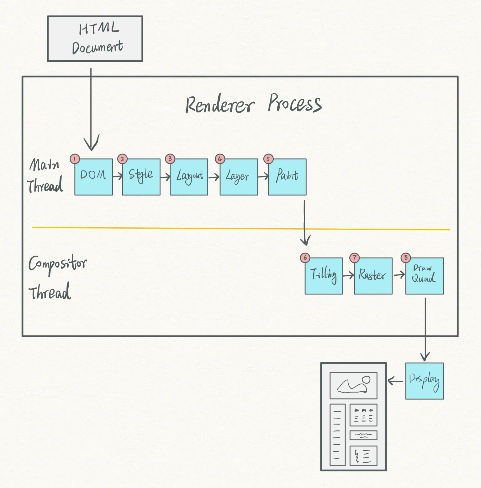

# React의 브라우저 렌더링 순서

## 1. HTML 파싱 및 초기 DOM 생성

- 브라우저는 HTML파일을 로드하고 파싱하여 초기 DOM(Document Object Model) 생성

- 실제로는 React 실행 전이기 때문에, 서버에서 전달된 HTML 혹은 빈 root(`
`)만 렌더링 됨

## 2. CSS 파싱 및 CSSOM 생성

- 브라우저는 HTML에 포함된 `<link>` 또는 `<style>` 태그를 통해 CSS 파일을 파싱, CSSOM(CSS Object Model) 생성

- CSSOM과 DOM이 결합되어 최종 렌더 트리를 형성

- 렌더 트리는 실제 화면에 보이는 요소만 가지고 있음

## 3. Javascript 로딩 및 실행

- 이후 브라우저는 `<script>` 태그의 Javascript 파일을 로드하고 실행

- 이 과정에서 React 코드가 로드

- React가 로드되면, Javascript는 가상 DOM을 생성하고 컴포넌트를 렌더링할 준비

### CSS-in-JS

- React와 함께 CSS-in-JS 라이브러리도 실행됨: 컴포넌트에 필요한 스타일을 계산하고 동적으로 생성

- 생성된 스타일은 `<style>` 태그로 DOM에 삽입되어 CSSOM에 반영

## 4. React 초기 렌더링

- React는 컴포넌트 트리(가상 DOM)을 생성

- JSX는 `React.createElement()`로 변환

## 5. 가상 DOM을 실제 DOM으로 변환 및 업데이트(Reconciliation)

- React의 Reconciliation 과정(재조정): React는 가상 DOM과 실제 DOM을 비교하여 실제 DOM에 필요한 최소한의 변경만을 적용

- 컴포넌트의 초기 상태를 기반으로 실제 DOM을 생성하거나 업데이트

### useInsertionEffect

- React의 Reconciliation(재조정) 과정 중, DOM이 업데이트되기 직전 시점에 실행

- DOM 업데이트 전 useInsertionEffect 실행: React가 DOM을 업데이트하기 직전에 useInsertionEffect가 실행. 이 단계에서 스타일 삽입, 클래스 추가, 특정 DOM 조작 등이 동기적으로 이루어짐.

- DOM 업데이트: useInsertionEffect가 완료된 후, React는 변경된 내용을 실제 DOM에 반영.

### useLayoutEffect

- Reconciliation로 인한 DOM 업데이트 이후 실행됨

- `useLayoutEffect`은 브라우저의 렌더링 엔진이 레이아웃을 계산하고 페인팅을 수행하기 전에 실행

## 6. 브라우저의 레이아웃 계산 및 페인팅

- 변경된 DOM과 CSSOM이 결합되어 수정된 브라우저의 렌더 트리를 형성

- 브라우저는 이 트리를 기반으로 각 요소의 위치를 계산하는 레이아웃(Layout, Reflow) 수행

- 계산된 레이아웃을 바탕으로 화면을 그리는 페인팅(Painting) 수행

### 렌더트리 생성 이후 브라우저 렌더링 과정

- 레이아웃(Layout, Reflow): 렌더 트리를 기반으로 각 요소의 크기와 위치를 계산

- 레이어링(Layering): 요소들 중 특정 속성(`position: fixed;`, `z-index`, CSS 애니메이션 등)을 가진 요소들이 새로운 레이어를 형성

- 페인팅(Painting): 각 레이어에서 요소의 스타일(색상, 그림자, 텍스트 등)을 픽셀 단위로 그림

- 타일링(Tiling): 화면을 작은 타일로 나누어 성능을 최적화 함. 또한 렌더링 작업을 비동기적으로 처리할 수 있게 해줌.

- 래스터화(Rasterization): 백터 그래픽을 비트맵 이미지로 변환

- 스크롤링(Scrolling) 및 컴포지팅(Compositing): 레이어가 스크롤되거나 이동, 투명도 변화 등 변형이 필요한 경우 적용. 컴포지팅은 여러 레이어를 하나의 화면으로 합성

- 디스플레이(Displaying): 최종적으로 완성된 이미지를 화면에 표시

## 7. 서브트리 업데이트 및 리렌더링

- React는 컴포넌트의 상태나 props가 변경될 때마다, 가상 DOM에서 변경된 부분만을 다시 렌더링(및 커밋)

- 이 때 React는 Fiber 알고리즘을 사용하여, DOM 업데이트의 우선순위를 관리하고, 화면의 중요 업데이트를 최적화함

- 변경된 가상 DOM은 실제 DOM과 비교되며, 최소한의 업데이트만 적용

## 8. 브라우저의 리페인트 및 리플로우

- DOM의 일부가 변경되면, 브라우저는 변경된 부분만 다시 계산하여 화면에 그리는 리페인트(Repaint)를 수행

- 경우에 따라 레이아웃이 다시 계산되어야 한다면, 리플로우가 발생하며 화면의 레이아웃이 재조정

### references

https://blog.minsug.dev/2024/04/react-rendering#%EB%A6%AC%EC%95%A1%ED%8A%B8-%ED%8C%80%EC%9D%80-%EC%99%9C-%ED%8C%8C%EC%9D%B4%EB%B2%84%EB%A5%BC-%EB%8F%84%EC%9E%85%ED%96%88%EC%9D%84%EA%B9%8C
https://cabulous.medium.com/how-does-browser-work-in-2019-part-iii-rendering-phase-i-850c8935958f
