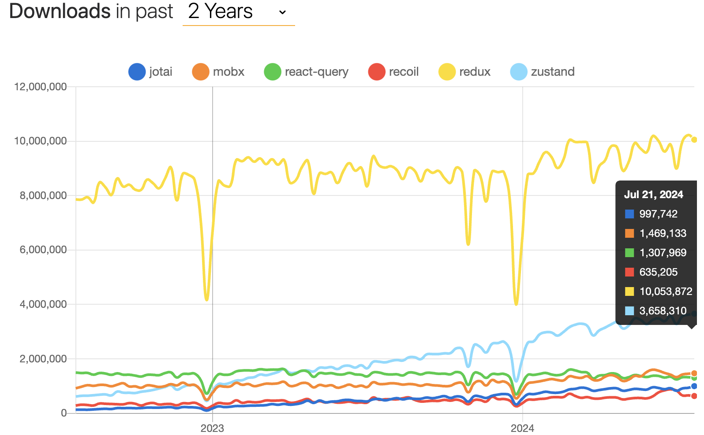

# [State 관리하기](https://ko.react.dev/learn/managing-state)

## State를 사용해 Input 다루기

### > 선언형 프로그래밍과 명령형 프로그래밍

[Is declarative programming just imperative programming 'under the hood'?](https://softwareengineering.stackexchange.com/questions/447137/is-declarative-programming-just-imperative-programming-under-the-hood)

선언적 프로그래밍도 명령형 프로그래밍의 한 형태일 수밖에 없다는 의문.

오로지 추상화의 관점에서 명령형 코드를 어느정도로(?) 숨겨놓았는지가 선언형 프로그래밍의 판단 기준. <br/>
또한 모든 명령형 언어도 일종의 선언적 특성을 지니며, 이러한 구별은 의미론적 차원에서의 논의에 불과하다.

복잡한 프로그램을 작성하는 과정에서 단계별 지침을 암묵적으로 제공해야 하는 문제를 해결하기 위해서는, <br/>
더 나은 추상화와 도구를 통해 선언적 접근 방식을 유지할 수 있는 방법을 모색해야 하는 것이 중요. 

따라서 선언적 프로그래밍과 명령형 프로그래밍의 구별은 언어의 특성과 추상화 수준에 따라 판단해야 하며, <br/>
판가름 그 자체보다 실제 구현의 복잡성 정도를 이해하는 것이 중요하다.

<br/>
<br/>

## State 구조 선택하기

### > Props를 state에 미러링

```typescript
function Message({ messageColor }: MessageProps) {
  const [color, setColor] = useState(messageColor);
  // ...
}
```
여기서 color state 변수는 messageColor prop로 초기화(이를 "**미러링**"이라고 한다). <br/>
문제는 부모 컴포넌트가 나중에 다른 값의 messageColor를 전달한다면, color state 변수 가 업데이트되지 않는다. <br/>
state는 첫 번째 렌더링 중에만 초기화된다. <br/>
Props를 상태로 “미러링”하는 것은 특정 prop에 대한 모든 업데이트를 무시하기를 원할 때에만 의미가 있다.

일반적인 경우에, 코드에 messageColor prop를 직접 사용한다. <br/>
더 짧은 이름을 지정하려면 상수를 사용.

```typescript
function Message({ messageColor }: MessageProps) {
  const color = messageColor;
  // ...
}
```

<br/>

### > Immer 라이브러리

#### < 기본 정보 >

<center>

<div>말이 많아도 Redux는 굳건하다.</div>
<div>(@reduxjs/toolkit의 기둥이 되는 것이 Immer.js)</div>
</center>

<br/>


> 1. [Why is Immer mentioned so much in Beta ReactJs Docs?](https://www.reddit.com/r/reactjs/comments/v0lvhi/why_is_immer_mentioned_so_much_in_beta_reactjs/)
> 2. [The Rise of Immer in React](https://www.netlify.com/blog/2018/09/12/the-rise-of-immer-in-react/)
> 3. [Immer Documentation](https://immerjs.github.io/immer/example-setstate)

Immer를 이해하기 앞서, Immer의 철학이 React의 원칙과 특히 어떻게 잘 들어맞는지 생각해 보는 데 시간을 할애하는 것이 좋다.

리액트 공식 문서의 Design Principles와 React의 핵심 신념을 통한 의사코드 진행인 react-basic를 기반으로 <br/>
Immer와 관련된 세 가지 개념을 강조한다.

1. Temporal Mutability

    data model이 immutable하기를 바라는 react의 선호 사상에서, <br/>
    Immer의 상태 업데이터가 react의 바람과 일치하는 형태를 띈다.

    ```javascript
    // MobX?
    clickHandler = () => this.state.count++ // obj data immutable을 원하는 리액트 관점에서 부적절
    ```
    ```javascript
    // React
    clickHandler = () => this.setState(state => ({
        count: state.count + 1
    }))
    ```
    ```javascript
    // Immer.js
    const nextState = produce(currentState, draft => {
    draft.count = draft.count + 1
    })
    ```

2. Interoperability

    Immutable.js 이라는 라이브러리가 있다. <br/>
    Netlify 등의 프로젝트에서도 사용되었던 Immutable.js는 React의 불변성 문제를 해결하기 위해 만들어졌다. <br/>
    즉, 배열, 객체, 맵 등의 기본 데이터 구조를 불변으로 다루는 API를 제공. <br/>
    하지만 Immutable.js에서 해결할 수 없었던 가장 큰 문제가 '**Interoperability**'.

    Immutable.js의 Map은 불변 객체로, JavaScript의 Map과는 상호 작용하는 방법이 다르다. <br/>
    특히, Immutable.js의 Map은 기본 JavaScript의 객체 속성 접근 방법을 지원하지 않는다.

    ```javascript
    // Immutable.js
    const map1 = Immutable.Map({ foo: 1, bar: 2 })
    const { foo, bar } = map1
    console.log(foo) // undefined
    console.log(bar) // undefined
    ```

    Immer를 사용하면 객체와 배열이 실제로 JavaScript 객체와 배열이 되므로 일반적으로 하는 모든 작업을 수행할 수 있다.
    ```javascript
    // Immer.js
    const map1 = { foo: 1, bar: 2 }
    const map2 = produce(map1, draft => {
        draft.foo += 10
    })
    const { foo, bar } = map2
    console.log(foo) // 11
    console.log(map1.bar === bar) // true
    ```

3. Debugging

    Immer의 고급 '패치 기능'을 사용하면 세부적인 디버깅과 추적이 가능해지고, 개발자 도구를 구축할 가능성도 있다. <br/>
    이는 React가 디버깅 가능성에 중점을 두는 것과 매우 유사.

    Patches 기능은 Immer가 상태 변경을 추적하고 기록할 수 있게 해주는 기능. <br/>
    이를 통해 상태 변경을 상세히 추적하고, 특정 상태 변경만을 반영하여 효율적인 상태 업데이트를 구현할 수 있다.

    ```javascript
    import {produceWithPatches} from "immer"

    const [nextState, patches, inversePatches] = produceWithPatches(
        {
            age: 33
        },
        draft => {
            draft.age++
        }
    )
    ```
    다음의 연산 결과가 나온다.
    ```
    [
        {
            age: 34
        },
        [
            {
                op: "replace", // 수행된 연산의 종류
                path: ["age"], // 변경된 데이터의 경로를 나타내는 배열
                value: 34 // 변경된 값
            }
        ],
        [
            {
                op: "replace",
                path: ["age"],
                value: 33
            }
        ]
    ] 
    ```

<br/>

#### < Immer.js의 핵심 produce()의 동작 >

기본 설명
https://immerjs.github.io/immer/produce

```typescript
// Immer.js의 /src/core/ImmerClass.ts
	produce: IProduce = (base: any, recipe?: any, patchListener?: any) => {
		// 1
		if (typeof base === "function" && typeof recipe !== "function") {
			const defaultBase = recipe
			recipe = base

			const self = this
			return function curriedProduce(
				this: any,
				base = defaultBase,
				...args: any[]
			) {
				return self.produce(base, (draft: Drafted) => recipe.call(this, draft, ...args))
			}
		}

		if (typeof recipe !== "function") die(6)
		if (patchListener !== undefined && typeof patchListener !== "function")
			die(7)

		let result

		if (isDraftable(base)) {
			const scope = enterScope(this) // 4
			const proxy = createProxy(base, undefined) // 2
			let hasError = true
			try {
				result = recipe(proxy) // 3
				hasError = false
			} finally {
				if (hasError) revokeScope(scope)
				else leaveScope(scope)
			}
			usePatchesInScope(scope, patchListener)
			return processResult(result, scope) // 5
		} else if (!base || typeof base !== "object") {
			result = recipe(base)
			if (result === undefined) result = base
			if (result === NOTHING) result = undefined
			if (this.autoFreeze_) freeze(result, true) // 6
			if (patchListener) {
				const p: Patch[] = []
				const ip: Patch[] = []
				getPlugin("Patches").generateReplacementPatches_(base, result, p, ip)
				patchListener(p, ip)
			}
			return result
		} else die(1, base)
	}
```

Immer의 produce 함수는 객체의 원본 상태를 해치지 않으면서 새로운 상태를 생성하는 데 사용된다. <br/>
이 기능은 불변성을 유지하면서 상태를 수정할 수 있게 한다. <br/>
이 과정에서 Immer는 내부적으로 프록시(Proxy)를 사용하여 상태를 안전하게 수정하고, 상태 변경 사항을 추적한다.

1. Curried Invocation

    produce 함수는 커링(curring) 형태로 호출될 수 있다. <br/>
    (인자를 여러개 받는 함수를 분리하여, 인자를 하나씩만 받는 함수의 체인으로 만드는 방법) <br/>
    이 경우, base가 함수일 때는 recipe가 기본 값으로 설정. 이 구조는 produce 함수의 유연성을 높여준다.

2. 프록시 생성

    프록시란?
    (Immer는 JavaScript의 Proxy 객체를 사용하여 원본 객체에 대한 접근을 감싸고 제어한다. <br/> 
    이를 통해 객체의 속성을 직접 수정하지 않고, 상태의 변경 사항을 기록하고 관리할 수 있다.)

    isDraftable(base) 함수가 호출되어 base가 draftable(프록시화 가능한) 객체인지 확인. <br/>
    프록시 객체는 createProxy(base, undefined)를 통해 생성. <br/>
    프록시는 원본 객체의 래퍼(wrapper)로, 원본 객체에 대한 접근을 제어할 수 있다.

3. 상태 변경

    recipe(proxy)가 호출. 이 때, proxy는 원본 객체의 래퍼로, recipe 함수 내에서 원본 객체의 상태를 수정. <br/>
    proxy를 통해 상태를 변경할 때, 실제 원본 객체는 변경되지 않고, 변경 사항은 내부적으로 트래킹.

4. 스코프 관리

    enterScope(this)와 leaveScope(scope)는 Immer의 상태 관리 스코프를 관리. <br/> 
    스코프는 상태 변경의 범위를 지정하고, 상태가 변경될 때 필요한 자원을 관리. <br/>
    revokeScope(scope)는 오류 발생 시 스코프를 취소하여 원본 상태를 보호.

5. 결과 처리

    processResult(result, scope)는 결과를 처리. 이 단계에서 새로운 상태가 최종적으로 생성된다. <br/>
    usePatchesInScope(scope, patchListener)는 상태 변경 사항을 패치(patch) 형태로 반환. <br/>
    patchListener가 정의된 경우, 패치와 반대 패치(inverse patches)를 호출하여 상태 변경을 추적할 수 있다.

6. 비드래프트 객체 처리

    base가 비드래프트 객체일 때(프록시가 필요 없는 경우), recipe가 직접 호출되어 원본 객체가 수정. 이 경우에도 불변성이 유지. <br/>
    결과는 freeze(result, true)를 통해 동결(freeze)되어 변형되지 않도록 보장한다.

<br/>

#### < 공식 문서에서의 사용 예시 >

1. [중첩된 객체 갱신하기](https://ko.react.dev/learn/updating-objects-in-state)

```javascript
// only state
import { useState } from 'react';

export default function Form() {
  const [person, setPerson] = useState({
    name: 'Niki de Saint Phalle',
    artwork: {
      title: 'Blue Nana',
      city: 'Hamburg',
      image: 'https://i.imgur.com/Sd1AgUOm.jpg',
    }
  });

  function handleNameChange(e) {
    setPerson({
      ...person,
      name: e.target.value
    });
  }

  function handleTitleChange(e) {
    setPerson({
      ...person,
      artwork: {
        ...person.artwork,
        title: e.target.value
      }
    });
  }

  function handleCityChange(e) {
    setPerson({
      ...person,
      artwork: {
        ...person.artwork,
        city: e.target.value
      }
    });
  }

  return (
    <>
      <!-- 생략 -->
    </>
  );
}
```
```javascript
// useImmer
import { useImmer } from 'use-immer';

export default function Form() {
  const [person, updatePerson] = useImmer({
    name: 'Niki de Saint Phalle',
    artwork: {
      title: 'Blue Nana',
      city: 'Hamburg',
      image: 'https://i.imgur.com/Sd1AgUOm.jpg',
    }
  });

  function handleNameChange(e) {
    updatePerson(draft => {
      draft.name = e.target.value;
    });
  }

  function handleTitleChange(e) {
    updatePerson(draft => {
      draft.artwork.title = e.target.value;
    });
  }

  function handleCityChange(e) {
    updatePerson(draft => {
      draft.artwork.city = e.target.value;
    });
  }

  return (
    <>
      <!-- 생략 -->
    </>
  );
}
```

2. [배열 내부 객체 업데이트](https://ko.react.dev/learn/updating-arrays-in-state)

```javascript
// only state
import { useState } from 'react';

let nextId = 3;
const initialList = [
  { id: 0, title: 'Big Bellies', seen: false },
  { id: 1, title: 'Lunar Landscape', seen: false },
  { id: 2, title: 'Terracotta Army', seen: true },
];

export default function BucketList() {
  const [myList, setMyList] = useState(initialList);
  const [yourList, setYourList] = useState(
    initialList
  );

  function handleToggleMyList(artworkId, nextSeen) {
    setMyList(myList.map(artwork => {
      if (artwork.id === artworkId) {
        return { ...artwork, seen: nextSeen };
      } else {
        return artwork;
      }
    }));
  }

  function handleToggleYourList(artworkId, nextSeen) {
    setYourList(yourList.map(artwork => {
      if (artwork.id === artworkId) {
        return { ...artwork, seen: nextSeen };
      } else {
        return artwork;
      }
    }));
  }

  return (
    <>
      <!-- 생략 -->
    </>
  );
}
```
```javascript
// useImmer
import { useState } from 'react';
import { useImmer } from 'use-immer';

let nextId = 3;
const initialList = [
  { id: 0, title: 'Big Bellies', seen: false },
  { id: 1, title: 'Lunar Landscape', seen: false },
  { id: 2, title: 'Terracotta Army', seen: true },
];

export default function BucketList() {
  const [myList, updateMyList] = useImmer(
    initialList
  );
  const [yourArtworks, updateYourList] = useImmer(
    initialList
  );

  function handleToggleMyList(id, nextSeen) {
    updateMyList(draft => {
      const artwork = draft.find(a =>
        a.id === id
      );
      artwork.seen = nextSeen;
    });
  }

  function handleToggleYourList(artworkId, nextSeen) {
    updateYourList(draft => {
      const artwork = draft.find(a =>
        a.id === artworkId
      );
      artwork.seen = nextSeen;
    });
  }

  return (
    <>
      <!-- 생략 -->
    </>
  );
}
```

3. [reducer 작성](https://ko.react.dev/learn/extracting-state-logic-into-a-reducer)

```javascript
// only useReducer
import React, { useCallback, useReducer } from "react";

const TodoList = () => {
    const initialTodos = [
        /* initial todos */
    ];

    const reducer = (state, action) => {
        switch (action.type) {
            case "toggle":
                return state.map(todo =>
                    todo.id === action.id
                        ? { ...todo, done: !todo.done }
                        : todo
                );
            case "add":
                return [
                    ...state,
                    {
                        id: action.id,
                        title: "A new todo",
                        done: false
                    }
                ];
            default:
                return state;
        }
    };

    const [todos, dispatch] = useReducer(reducer, initialTodos);

    const handleToggle = useCallback(id => {
        dispatch({
            type: "toggle",
            id
        });
    }, []);

    const handleAdd = useCallback(() => {
        dispatch({
            type: "add",
            id: "todo_" + Math.random()
        });
    }, []);

    return (
        <div>
            <!-- 생략 -->
        </div>
    );
};

export default TodoList;

```
```javascript
// useReducer + Immer
import React, {useCallback, useReducer} from "react"
import {produce} from "immer"

const TodoList = () => {
    const [todos, dispatch] = useReducer(
        produce((draft, action) => {
            switch (action.type) {
                case "toggle":
                    const todo = draft.find(todo => todo.id === action.id)
                    todo.done = !todo.done
                    break
                case "add":
                    draft.push({
                        id: action.id,
                        title: "A new todo",
                        done: false
                    })
                    break
                default:
                    break
            }
        }),
        [
            /* initial todos */
        ]
    )

    const handleToggle = useCallback(id => {
        dispatch({
            type: "toggle",
            id
        })
    }, [])

    const handleAdd = useCallback(() => {
        dispatch({
            type: "add",
            id: "todo_" + Math.random()
        })
    }, [])
}
```
```javascript
// useImmerReducer
import React, { useCallback } from "react";
import { useImmerReducer } from "use-immer";

const TodoList = () => {
  const [todos, dispatch] = useImmerReducer(
    (draft, action) => {
      switch (action.type) {
        case "toggle":
          const todo = draft.find((todo) => todo.id === action.id);
          todo.done = !todo.done;
          break;
        case "add":
          draft.push({
            id: action.id,
            title: "A new todo",
            done: false
          });
          break;
        default:
          break;
      }
    },
    [ /* initial todos */ ]
  );
```

<br/>
<br/>

## 컴포넌트 간 State 공유하기

### > 제어와 비제어 컴포넌트

“제어되지 않은” 몇몇 지역 state를 갖는 컴포넌트를 사용하는 것은 흔하다. <br/>

어떤 UI를 그리는 state를 가지는 자식 컴포넌트가 있고 부모에서 자식의 활성화 여부에 영향을 줄 수 없는 형태라면 이는 "제어될 수 없다"고 표현한다. <br/>
반대로 컴포넌트의 중요한 정보가 자체 지역 state 대신 props에 의해 만들어지는 경우 컴포넌트가 “제어된다”고 표현한다. <br/>
이를 통해 부모 컴포넌트가 동작을 완전히 지정할 수 있다. prop을 갖는 최종 자식 컴포넌트는 부모 컴포넌트에 의해 제어된다.

비제어 컴포넌트는 설정할 것이 적어 부모 컴포넌트에서 사용하기 더 쉽다. <br/>
하지만 여러 컴포넌트를 함께 조정하려고 할 때 비제어 컴포넌트는 유연성이 적다. <br/>

실제로 “제어”와 “비제어”는 엄격한 기술 용어가 아니며 일반적으로 컴포넌트는 지역 state와 props를 혼합해서 사용한다. <br/>
그러나 이런 구분은 컴포넌트의 설계와 제공하는 기능에 관해 설명하는데 유용한 방법으로써 사용된다.

컴포넌트를 작성할 때 어떤 정보가 (props를 통해) 제어되어야 하고 어떤 정보가 (state를 통해) 제어되지 않아야 하는지 고려하라.

<br/>

### > 라우팅 라이브러리 내 현재 경로의 사용 with State + Context 

라우팅 라이브러리가 State를 사용하여 현재 경로(url)을 어떤식으로 return하는지 확인해보고자 함.

```typescript
// react-router/lib/hooks.tsx
import {
  UNSAFE_invariant as invariant,
} from "@remix-run/router"; // 주어진 조건이 거짓이면 에러 발생. 이는 보통 런타임 검사를 위해 사용.

export function useInRouterContext(): boolean {
  return React.useContext(LocationContext) != null; // 컴포넌트가 라우터 컨텍스트 내에 있는지 확인.
}

export function useLocation(): Location {
  invariant(
    useInRouterContext(),
    // TODO: This error is probably because they somehow have 2 versions of the
    // router loaded. We can help them understand how to avoid that.
    `useLocation() may be used only in the context of a <Router> component.`
  );

  return React.useContext(LocationContext).location;
}
```
```typescript
// react-router/lib/context.ts
interface LocationContextObject {
  location: Location;
  navigationType: NavigationType;
}

export const LocationContext = React.createContext<LocationContextObject>(
  null!
);
```
```typescript
// example/Auth/App.tsx
function RequireAuth({ children }: { children: JSX.Element }) {
  let auth = useAuth();
  let location = useLocation();

  if (!auth.user) {
    return <Navigate to="/login" state={{ from: location }} replace />;
  }

  return children;
}
```

<br/>
<br/>

## State를 보존하고 초기화하기

### > React의 관심사? JSX 마크업 (X), UI 트리에서의 위치 (O)

React는 함수 안 어디에 조건문이 있는지 모른다. 반환하는 트리만 본다. <br/>
또한 같은 위치에 다른 컴포넌트를 렌더링할 때 컴포넌트는 그의 전체 서브 트리의 state를 초기화. <br/>
자식 div가 DOM에서 제거될 때 그것의 전체 하위 트리(Counter와 그 state를 포함해서)는 제거.

리렌더링할 때 state를 유지하고 싶다면, 트리 구조가 “같아야” 한다. <br/>
만약 구조가 다르다면 React가 트리에서 컴포넌트를 지울 때 state로 지우기 때문에 state가 유지되지 않는다.

이것이 컴포넌트 함수를 중첩해서 정의하면 안되는 이유.
```javascript
import { useState } from 'react';

export default function MyComponent() {
  const [counter, setCounter] = useState(0);

  function MyTextField() {
    const [text, setText] = useState('');

    return (
      <input
        value={text}
        onChange={e => setText(e.target.value)}
      />
    );
  }

  return (
    <>
      <MyTextField />
      <button onClick={() => {
        setCounter(counter + 1)
      }}>Clicked {counter} times</button>
    </>
  );
}
```
MyComponent를 렌더링할 때마다 다른 MyTextField 함수가 만들어지기 때문에 버튼을 누를 때마다 입력 state가 사라진다. <br/>
같은 함수에서 다른 컴포넌트를 렌더링할 때마다 React는 그 아래의 모든 state를 초기화. <br/>
이런 문제를 피하려면 항상 컴포넌트를 중첩해서 정의하지 않고 최상위 범위에서 정의해야 한다.


<br/>

### > 제거된 컴포넌트의 state 보존

```javascript
import { useState } from 'react';
import Chat from './Chat.js';
import ContactList from './ContactList.js';

export default function Messenger() {
  const [to, setTo] = useState(contacts[0]);
  return (
    <div>
      <ContactList
        contacts={contacts}
        selectedContact={to}
        onSelect={contact => setTo(contact)}
      />
      <Chat key={to.id} contact={to} />
    </div>
  )
}

const contacts = [
  { id: 0, name: 'Taylor', email: 'taylor@mail.com' },
  { id: 1, name: 'Alice', email: 'alice@mail.com' },
  { id: 2, name: 'Bob', email: 'bob@mail.com' }
];
```
```javascript
export default function ContactList({
  selectedContact,
  contacts,
  onSelect
}) {
  return (
    <section className="contact-list">
      <ul>
        {contacts.map(contact =>
          <li key={contact.id}>
            <button onClick={() => {
              onSelect(contact);
            }}>
              {contact.name}
            </button>
          </li>
        )}
      </ul>
    </section>
  );
}
```
```javascript
import { useState } from 'react';

export default function Chat({ contact }) {
  const [text, setText] = useState('');
  return (
    <section className="chat">
      <textarea
        value={text}
        placeholder={'Chat to ' + contact.name}
        onChange={e => setText(e.target.value)}
      />
      <br />
      <button>Send to {contact.email}</button>
    </section>
  );
}
```

실제 채팅 앱에서는 이전의 수신자를 선택했을 때 입력값이 복구되는 것을 원할 것. <br/>
보이지 않는 컴포넌트의 state를 “살아 있게”하는 몇 가지 방법이 있다.

- 현재 채팅만 렌더링하는 대신 모든 채팅을 렌더링하고 CSS로 안 보이게 할 수 있다. <br/>
이 방법은 간단한 UI에서 잘 작동. 하지만 숨겨진 트리가 크고 많은 DOM 노드를 가지고 있다면 매우 느려진다.

- state를 상위로 올리고 각 수신자의 임시 메시지를 부모 컴포넌트에 가지고 있을 수 있다. <br/>
이 방법에서 부모가 중요한 정보를 가지고 있기 때문에 자식 컴포넌트가 제거되어도 상관이 없다. (가장 일반적인 해법)

- React state 이외의 다른 저장소를 이용. <br/>
가령 localStorage에 메시지를 저장하고 이를 이용해 Chat 컴포넌트를 초기화할 수 있다.

어떤 방법을 선택하더라도 Alice와의 채팅은 Bob과의 채팅과 개념상 구별되기 때문에 <br/>
현재 수신자를 기반으로 \<Chat> 트리에 key를 주는 것(key를 이요한 state초기화 방법)이 타당하다.

<br/>
<br/>

## State 로직을 리듀서로 작성하기

### > useState와 useReducer 비교

- 코드 크기
  
  일반적으로 useState를 사용하면, 미리 작성해야 하는 코드가 줄어든다. <br/>
  여러 이벤트 핸들러에서 비슷한 방식으로 state를 업데이트하는 경우, useReducer를 사용하면 코드의 양을 줄이는 데 도움이 될 수 있다.

- 가독성

  useState로 간단한 state를 업데이트하는 경우 가독성이 좋은 편. <br/>
  그렇지만 더 복잡한 구조의 state를 다루게 되면 컴포넌트의 코드 양이 더 많아져 한눈에 읽기 어려워질 수 있다. <br/>
  useReducer를 사용하면 업데이트 로직이 어떻게 동작하는지와 이벤트 핸들러를 통해서 무엇이 발생했는지 구현한 부분을 명확하게 구분 가능

- 디버깅
  
  useState를 사용하며 버그를 발견했을 때, 왜, 어디서 state가 잘못 설정됐는지 찾기 어려울 수 있다. <br/>
  useReducer를 사용하면, 콘솔 로그를 reducer에 추가하여 state가 업데이트되는 모든 부분과 왜 해당 버그가 발생했는지(어떤 action으로 인한 것인지)를 확인할 수 있다.

- 테스팅
  
  reducer는 컴포넌트에 의존하지 않는 순수 함수. <br/>
  이는 reducer를 독립적으로 분리해서 내보내거나 테스트할 수 있다는 것을 의미한다. <br/>
  일반적으로 더 현실적인 환경에서 컴포넌트를 테스트하는 것이 좋지만, 복잡한 state를 업데이트하는 경우 <br/>
  reducer가 특정 초기 state 및 action에 대해 특정 state를 반환한다고 생각하고 테스트하는 것이 유용할 수 있다.

선호도의 문제. useState와 useReducer는 동일한 방식이기 때문에 언제나 마음대로 바꿔서 사용해도 무방하다.

<br/>
<br/>

## Context를 사용해 데이터를 깊게 전달하기

### > Context가 유의미한 영역

- 테마 지정하기

  사용자가 모양을 변경할 수 있는 애플리케이션의 경우, <br/> 
  context provider를 앱 최상단에 두고 시각적으로 조정이 필요한 컴포넌트에서 context를 사용할 수 있다.

- 현재 계정
  
  로그인한 사용자를 알아야 하는 컴포넌트가 많을 수 있으며, <br/>
  일부 애플리케이션에서는 동시에 여러 계정을 운영할 수도 있습니다(e.g. 다른 사용자로 댓글을 남기는 경우). <br/>
  이런 경우에는 UI의 일부를 서로 다른 현재 계정 값을 가진 provider로 감싸 주는 것이 편리.

- 라우팅
  
  대부분의 라우팅 솔루션은 현재 경로를 유지하기 위해 내부적으로 context를 사용한다. <br/>
  이것이 모든 링크의 활성화 여부를 “알 수 있는” 방법.

- 상태 관리 

  애플리케이션이 커지면 결국 앱 상단에 수많은 state가 생긴다. <br/>
  아래 멀리 떨어진 많은 컴포넌트가 그 값을 변경하고싶어할 수 있습니다. <br/>
  흔히 reducer를 context와 함께 사용하는 것은 복잡한 state를 관리하고 번거로운 작업 없이 멀리 있는 컴포넌트까지 값을 전달하는 방법.

<br/>
<br/>

## Reducer와 Context로 앱 확장하기

(생략)

<br/>
<br/>
