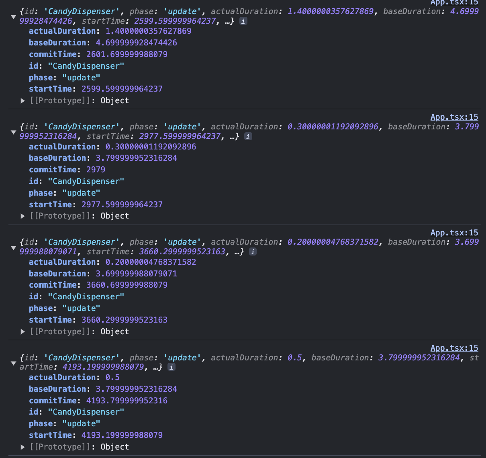
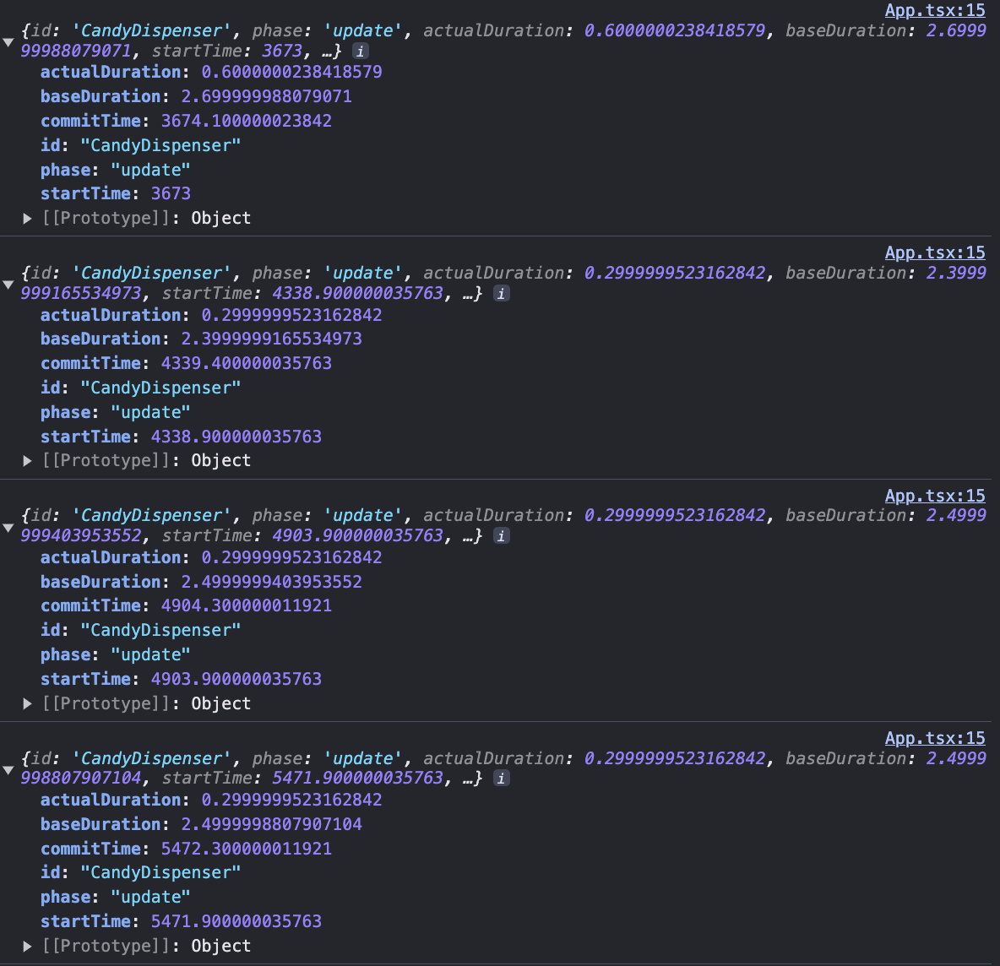
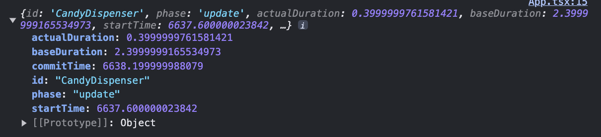
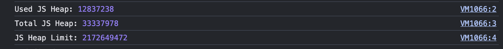
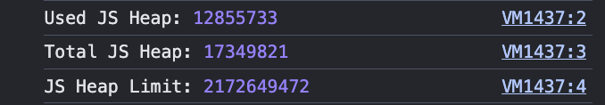
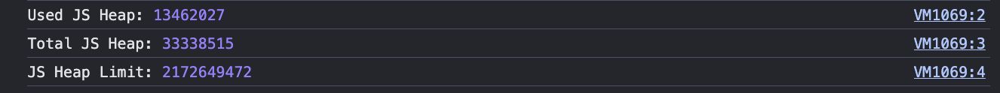
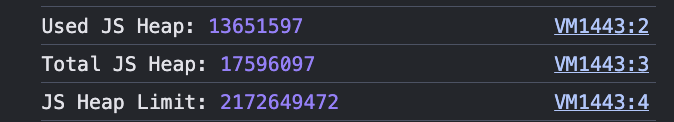

## 메모이제이션을 통한 최적화의 함정

메모이제이션은 순수 함수 호출을 최적화하고, 중복 계산을 줄이며, 성능을 향상시키는 방법을 제공함으로써 <br/> 
함수형 프로그래밍 패러다임을 보완하는 강력한 기술이다.

그렇다면 메모이제이션을 사용하면 무조건 성능이 좋아질까? <br/>
그렇지 않다. 모든 라인에 있는 코드는 실행될 때 비용을 수반한다.

```typescript
function CandyDispenser() {
  const initialCandies = ["snickers", "skittles", "twix", "milky way"];
  const [candies, setCandies] = React.useState(initialCandies);
  const dispense = (candy) => {
    setCandies((allCandies) => allCandies.filter((c) => c !== candy));
  };
  return (
    <div>
      <h1>Candy Dispenser</h1>
      <div>
        <div>Available Candy</div>
        {candies.length === 0 ? (
          <button onClick={() => setCandies(initialCandies)}>refill</button>
        ) : (
          <ul>
            {candies.map((candy) => (
              <li key={candy}>
                <button onClick={() => dispense(candy)}>grab</button> {candy}
              </li>
            ))}
          </ul>
        )}
      </div>
    </div>
  );
}
```

handleDispense 함수를 useCallback으로 감싸면 성능이 좋아지는가? <br/>
initialCandies를 useMemo로 감싸는 것은? <br/>

dispense 함수는 내부에서 state나 props등 퍼모먼스에 영향을 미치는 값이 없다. <br/>
따라서 useCallback의 호출, 의존성 배열을 선언해 주면서 리소스를 낭비하게 되며 메모이징과정의 추가적인 메모리만 사용. <br/>
또한 dispense 함수를 리턴하는 인라인 함수를 onClick에 전달하고 있기 때문에 useCallback을 감싼 함수는 가비지 컬렉션의 대상이 되지 않지만 인라인 함수는 계속해서 생성되어 useCallback의 성능 이점을 잃게 된다. 

initialCandies에서도 마찬가지다. <br/>
initialCandies는 상수이기 때문에 useMemo로 감싸는 것은 불필요. <br/>
마찬가지로 useMemo 사용으로 인한 추가적인 메모리 사용이 비용적으로 더 비싸게 나온다.

```typescript
import React from 'react';
import styled from 'styled-components';
import './App.css';

import CandyDispenser from './components/CandyDispenser';

const onRenderCallback: React.ProfilerOnRenderCallback = (
  id: string,
  phase: 'mount' | 'update' | 'nested-update',
  actualDuration: number,
  baseDuration: number,
  startTime: number,
  commitTime: number,
) => {
  console.log({
    id,
    phase,
    actualDuration,
    baseDuration,
    startTime,
    commitTime,
  });
};
export default function App() {
  return (
    <React.Profiler id="CandyDispenser" onRender={onRenderCallback}>
      <Container>
        <CandyDispenser />
      </Container>
    </React.Profiler>
  );
}

const Container = styled.div
  display: flex;
  justify-content: center;
  align-items: center;

  width: 100%;
  height: 100%;
;
```
Profiler를 통한 렌더링 성능측정.

<center>
좌측이 메모이제이션을 적용하지 않음. / 우측이 메모이제이션을 적용.
</center>

<figure class="half">  


</figure>
<figure class="half">  
 
 
</figure>

눈여겨 볼 부분은 actualDuration.

React의 actualDuration은 컴포넌트의 렌더링에 걸린 시간을 측정하는 중요한 지표로서 <br/> 메모이제이션 성능 비교를 위해 유용하게 사용할 수 있다.

메모이제이션 성능 자체에 의한 개선 혹은 악화보다도 <br/>
브라우저의 성능, 다른 탭에서의 활동, 시스템의 CPU 및 메모리 상황 등의 외부적인 요소에 의한 변동이 더 큰 듯 하다.

굉장히 많은 수로 측정하여 평균을 측정하는 방식으로 재측정이 요구된다.

<br/>

다음은
```javascript
if (window.performance && window.performance.memory) {
  console.log('Used JS Heap:', window.performance.memory.usedJSHeapSize);
  console.log('Total JS Heap:', window.performance.memory.totalJSHeapSize);
  console.log('JS Heap Limit:', window.performance.memory.jsHeapSizeLimit);
}
```
을 통한 브라우저 메모리 사용 측정

<br/>

<center>
좌측이 메모이제이션을 적용하지 않음. / 우측이 메모이제이션을 적용.
</center>

<figure class="half">  


</figure>
<figure class="half">  


</figure>

생각한대로 나오긴 했지만, 마찬가지로 외부요소에 대한 영향이 너무 커 유의미한 측정이라고 단정짓기 어려움.

<br/>
<br/>

## 함수형 프로그래밍

채은님이 설명해주신 것에 제가 잠깐 정리했던 내용만 담겠습니다.

> 실무에서 OOP vs FP
> 

대립되는 개념은 아님. 특히 Javascript Field는 멀티 패러다임을 지향하기 때문. <br/>
두 개념이 활약할 수 있는 영역이 다르다.

`OOP는 구조 설계, 모듈 분리 등의 거시적 관점에서의 역할.` <br/>
`FP는 코드의 가독성, side effect 최소화 등의 미시적 관점에서의 역할.`

`OOP는 현실에 있는 무언가를 코드로 표현하기 위해 객체로 적는 것.` <br/>
`FP는 추상적인 것들을 작성하고 모아 현실에 다가가는 과정.`

패러다임은 도구이고, 개인들의 취향에 맞게 적재적소에 활용하는게 중요하다.

<br/>

> 프로그래밍이라는 행위의 가치
>

야생의 개발자(취준생(?))라면 기술이나 구현 자체만으로 만족할 수 있을 것. <br/>
우리는 기업에 고용되어 가치를 창출해야하는 전문가로써의 위치이기 때문에 보다 더 깊이감있는 접근이 필요. <br/>
(사용자경험, 기업의 가치 창출)

<br/>

> ETC.
>
- FP: function pipelining, lazy evaluation등 장점이 많다.
- FP에서 가장 중요한 개념: “함수를 일급 객체로 다루기”

<br/>

> function pipelining, lazy evaluation ?

[function pipelining example](https://github.com/dltkdals224/dev-book_and_lecture/blob/main/%ED%95%A8%EC%88%98%ED%98%95%20%ED%94%84%EB%A1%9C%EA%B7%B8%EB%9E%98%EB%B0%8D%EA%B3%BC%20JavaScript%20ES6%2B/4.%20%EC%BD%94%EB%93%9C%EB%A5%BC%20%EA%B0%92%EC%9C%BC%EB%A1%9C%20%EB%8B%A4%EB%A3%A8%EC%96%B4%20%ED%91%9C%ED%98%84%EB%A0%A5%20%EB%86%92%EC%9D%B4%EA%B8%B0.md)

[lazy evaluation example](https://github.com/dltkdals224/dev-book_and_lecture/blob/main/%ED%95%A8%EC%88%98%ED%98%95%20%ED%94%84%EB%A1%9C%EA%B7%B8%EB%9E%98%EB%B0%8D%EA%B3%BC%20JavaScript%20ES6%2B%20%EC%9D%91%EC%9A%A9%ED%8E%B8/5.%20%EC%8B%9C%EA%B0%84%EC%9D%84%20%EC%9D%B4%ED%84%B0%EB%9F%AC%EB%B8%94%EB%A1%9C%20%EB%8B%A4%EB%A3%A8%EA%B8%B0.md)


<br/>
<br/>